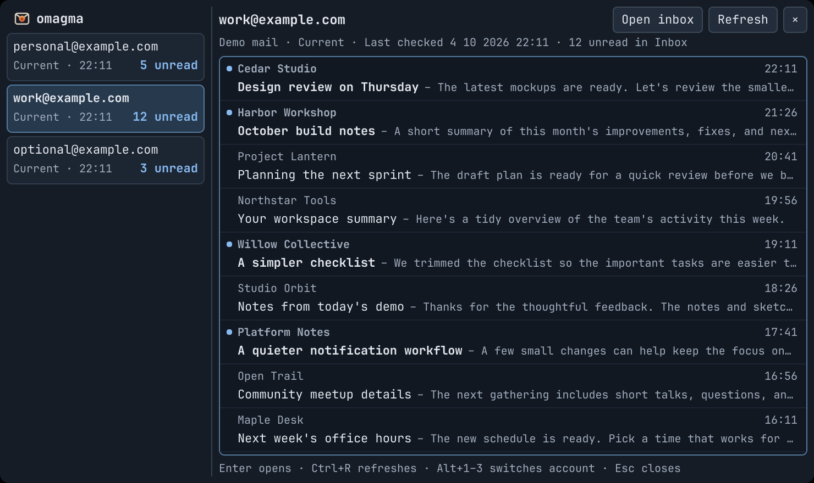
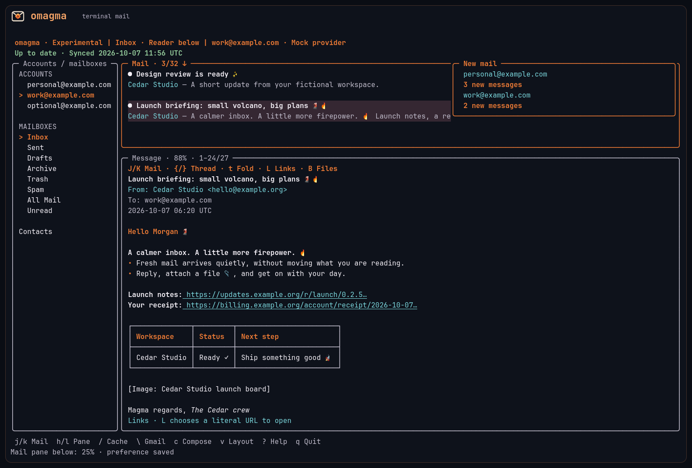

# omagma

Gmail in the Omarchy bar, your Linux or Mac terminal, and agent workflows. Keep up to three accounts separate, check recent mail without a browser tab, and open Gmail in each account’s configured Chrome profile.

[Explore the website and user documentation](https://technologylab-ai.github.io/omagma/).



The compact bar dropdown shows each account’s unread count, sender, subject, time and message snippet. It keeps up to 30 recent Inbox messages per account in memory, with optional five-minute background refresh. The bar is read-only and does not save mail to disk.

Omagma started because one Gmail tab was using roughly **2 GB of RAM** on the author’s desktop. On 2026-10-05, Omagma’s backend and attributed UI share measured approximately **31 MB for three connected accounts** in v0.2.2 on Linux x86_64. Chrome and unrelated shell widgets are excluded. These are approximate observations, not a controlled browser benchmark. [Memory details](docs/MEMORY.md).

## Install

**Recommended: agent-guided setup.** Give your coding agent the [website URL](https://technologylab-ai.github.io/omagma/)
or [GitHub URL](https://github.com/technologylab-ai/omagma) and ask it to install Omagma and walk you through Google Console and OAuth one
step at a time. Tell it your platform and whether you want the Linux read-only bar or full TUI/CLI
access. On macOS, Homebrew is preferred: `brew install renerocksai/tap/omagma`. It can prepare private configuration and open consent in each account's
Chrome profile while you complete the Google steps.
[Copy a setup prompt](docs/AGENT-SETUP.md).

For macOS, [install with Homebrew](docs/MACOS.md), then follow the terminal-only Google setup. Native Apple Silicon and Intel binaries are also available as verified release bundles. The bar remains a Linux Omarchy integration.

For manual Linux setup:

1. [Download the latest release](https://github.com/technologylab-ai/omagma/releases/latest), choosing the complete Linux **x86_64** or **arm64** bundle and its `SHA256SUMS`.
2. Follow [installation](docs/INSTALL.md) to verify the download and add the widget to your bar.
3. Follow [account setup](docs/SETUP.md) to create your Google OAuth registration, map each account to its Chrome profile, and approve access.

**No Zig compiler is needed for a release.** Linux bundles include a static musl backend and the Quickshell UI. Mac binaries use system libraries and Keychain. Live mail needs Chrome and an unlocked platform keyring; the TUI needs a UTF-8 terminal. Only the Linux bar needs Omarchy/Quickshell. ARM backend builds are tested separately; ARM desktop integration has not been qualified. [Mac installation](docs/MACOS.md) · [Linux installation](docs/INSTALL.md).

[AGENTS.md](AGENTS.md) directs agents to the included [setup workflow](skills/omagma-setup/SKILL.md). They can read it directly; installing it as a global skill is optional.

## Use the bar

Click the magma icon, choose an account, and select a message to preview its snippet. Activate a message or choose **Open inbox** to open the matching Gmail page in that account’s Chrome profile. **Open TUI** opens that account in a floating terminal. **Refresh** updates the selected account. Accounts have separate lists and counts; there is no combined Inbox.

Set `refreshIntervalSeconds` to `300` in your private account configuration to refresh every five minutes, including while the dropdown is closed. It defaults to `0`, which disables scheduled refresh. [Dropdown keys and states](docs/UI.md) · [Background refresh](docs/BACKGROUND-REFRESH.md).

## Terminal and agents

**The TUI and CLI are experimental.** Launch the terminal client with `omagma tui`. It provides separate accounts, full mail and threads, a reader beside or below the list, Vim keys, mouse navigation, native HTML-to-text display, search, local drafts, replies/forwarding, contacts, custom labels, attachments, mailbox changes and invitation replies. `$EDITOR` takes over the terminal and returns to the draft; tmux is not required. Calendar views, permanent mail deletion and contact deletion remain outside the current scope. [CLI/TUI coverage](docs/AGENT-CLI.md#cli-and-tui-coverage) describes their interface differences.



The running TUI adopts background cache updates, preserving your reading spot. A **New mail** card accumulates arrivals per account and clears on interaction. `gg` jumps to the first cached mail. Long links use compact colored labels with complete destinations available through `L`; HTML images use text placeholders. [0.2.7 release notes](docs/release-notes/0.2.7.md).

`T` opens the theme picker: choose the orange **Omagma** palette or **Follow
Omarchy**, with live preview and a saved preference. Unread subjects, stars and
label names stay visible. Help is searchable with `/`; dialog buttons support
Tab/Shift+Tab and Enter. See [all features](docs/FEATURES.md) and
[next priorities](docs/ROADMAP.md).

The v0.2.6 Linux x86_64 TUI settled at approximately **12 MB of RAM with three fictional accounts** in its 1,000-cycle workload. Markdown composition settled around **13 MB** in a separate lifecycle workload. These are complete Omagma processes, excluding the terminal emulator, editor and separately running bar; larger bodies have separate measurements. [Memory details](docs/MEMORY.md#published-terminal-workload-v026).

Available cached mail appears immediately while Gmail refreshes in the background. The default disk cache keeps the newest **2,000 messages within 256 MiB per account**, evicting the oldest tail. The cache is private plaintext storage, separate from the bar’s memory-only cache. `/` searches the cache, and `\` explicitly searches Gmail. An optional [five-minute Linux timer](docs/TERMINAL-BACKGROUND.md) keeps the terminal cache ready while the TUI is closed; Mac installation does not add a background service.

`omagma cli` and `omagma agent` provide a JSONL interface. One-shot `mail`, `draft`, `contacts`, `invitations`, `operation` and `cache` commands share that interface’s account-scoped executor. Explicit pagination can fetch more than the bar’s 30 messages. See [terminal workflows and keys](docs/TERMINAL.md) and [the agent CLI contract](docs/AGENT-CLI.md).

The TUI checks for stable releases every 24 hours and shows an **Upgrade
available** card with **Dismiss** and **How to update**. The guide follows the
actual Omarchy/Homebrew/manual installation and can hand the task to an agent.
The CLI shares `omagma updates status|check|guide|dismiss`; checks need no Google
authorization. [Update controls and procedures](docs/UPDATES.md).

Existing bar credentials allow read-only mail access. Sending, mailbox changes and contacts need [terminal authorization](docs/SETUP.md#full-tuicli-permissions). A terminal-only installation can start with one Google OAuth registration; if you already use the bar, keep its read-only registration and use a different one for the terminal. Choose your permissions and authorize each account separately.

Forward files, choose verified sending identities, recover drafts automatically, and search downloaded bodies. Folded threads, link and attachment pickers, bulk changes with undo, continuous cached-mail navigation, and saved working context keep daily mail work compact. See [the feature catalogue](docs/FEATURES.md) for the complete overview.

Ctrl+P or `:actions` opens the action palette. Find within a message with
`:find TEXT`, move through cached unread mail, and reuse account-specific search
history or named searches. Labels have checked/mixed states and an explicit
Apply step; the label manager also sets colors. `:scope message|thread` makes
conversation triage deliberate and reviews its exact targets.

Compose offers Ctrl+Z/Y text undo/redo, a verified From chooser and named
recipient completion. `:preview-browser` opens a private, isolated outgoing
preview with scripts and remote fetches blocked. Select several files in one
visit, stream received files to new private destinations, or use Save All.
Ordinary outgoing files have a 25 MiB combined limit; the MIME upload limit is
35 MiB. Contacts preserve multiple addresses, and sender-to-contact, local
draft discard and Spam/Not spam are available from the TUI.

Markdown composition includes a rendered outgoing
preview, readable plain-text alternative and retained reply/forward context.
New TUI compositions use Markdown; Ctrl+T switches to Plain without changing
source, and normal-mode `p` selects preview/original/plain. Existing drafts keep
their format. The CLI opts in with `--format markdown` and can inspect both
alternatives through `draft preview`. Explicit send review starts a cancellable
ten-second countdown; Ctrl+Z, Enter or the Undo button cancels before submission.
`:send-grace 0..30` changes that delay. A restarted pending send stays paused
until `:resume-send`; uncertain submissions are protected from automatic retry.
[Compose workflow](docs/TERMINAL.md#compose-reply-and-forward) ·
[Markdown CLI](docs/AGENT-CLI.md#markdown-drafts-and-preview).

To explore without Google credentials, use the optional fictional-mail demo:

```sh
omagma tui --fixtures
omagma mail list --fixtures --account personal@example.com --limit 100
omagma cli --fixtures
```

Fixture mode never contacts Google. It is optional and is not part of normal installation.

## Documentation

- [Documentation index](docs/README.md) and [feature catalogue](docs/FEATURES.md)
- [Install on Linux](docs/INSTALL.md) or [macOS](docs/MACOS.md), [connect accounts](docs/SETUP.md), and [agent-assisted setup](docs/AGENT-SETUP.md)
- [Bar behavior](docs/UI.md), [terminal guide](docs/TERMINAL.md), and [agent CLI](docs/AGENT-CLI.md)
- [Terminal cache](docs/TUI-CACHE.md) and [background terminal fetching](docs/TERMINAL-BACKGROUND.md)
- [Privacy and credentials](docs/PRIVACY.md) and [memory measurements](docs/MEMORY.md)
- [Development and source builds](docs/DEVELOPMENT.md), [architecture and transport](docs/TRANSPORT.md), and [release publishing](docs/RELEASING.md)
- Social images: [New mail and compact links](docs/images/omagma-tui-arrivals.png) · [Inbox view](docs/images/omagma-social.png) · [Mail preview and emoji](docs/images/omagma-social-preview.png)

## Build from source

Omarchy may still ship Zig 0.16.x. Source builds require **Zig 0.17.0 exactly**: download the archive matching your OS/CPU from [the official 0.17.0 directory](https://ziglang.org/download/0.17.0/), select its extracted directory on `PATH`, and confirm `zig version` prints `0.17.0`. Keep the system compiler unchanged. Build commands and developer checks are in [development](docs/DEVELOPMENT.md#build-from-source).

MIT licensed. Copyright technologylab.ai. Release distributions include [third-party notices](LICENSES), including Zig, musl, libvaxis, zigimg and uucode.
